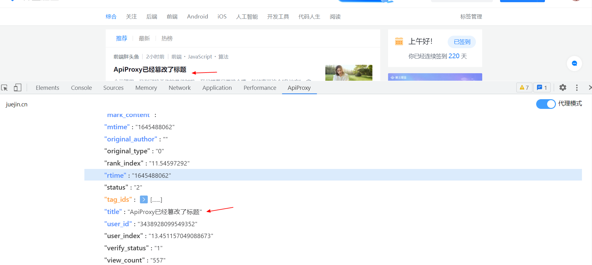
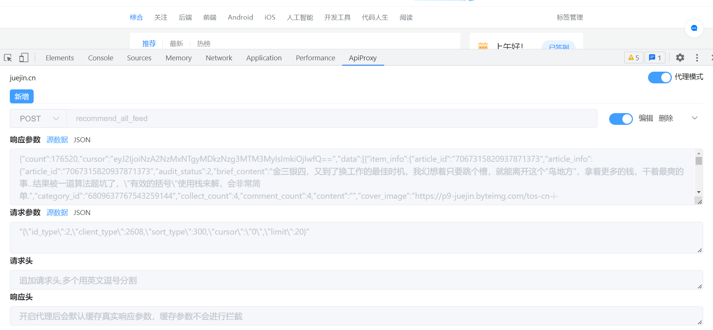
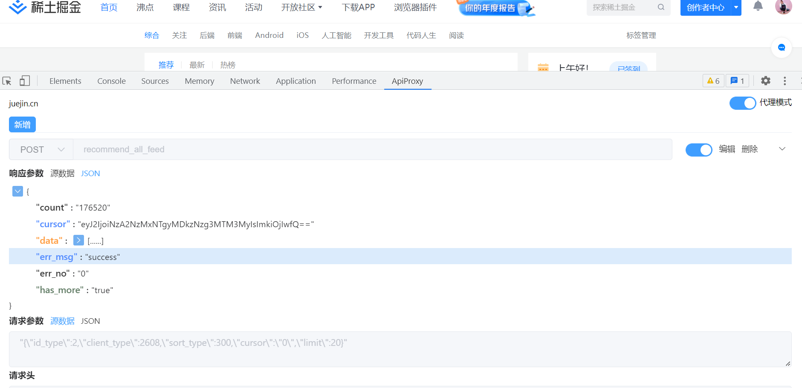

# ApiPrxoy

极简的 API 代理工具!

背景：不想写 mock，mock 语法老忘记！并不需要多真实的数据，只需要一个模板数据，简单更改，所以写了这个插件！前端时间看见有人分享了 Ajax Interceptor 的 chrome 插件，就想着自己也可以写一个试试，就做了这个插件

## demo

## 请求拦截

- 拦截 fetch 请求
- 拦截 xmrhttprequest 请求
- 请求参数可配置
- 响应参数可配置
- Json 可视化编辑
- 请求头暂时只支持追加
- 响应头不支持修改

## 后续计划

- 完善参数配置可视化
- 增加 mock 语法支持
- 增加请求头，响应头相关配置

## 具体实现

- 重写 fetch 和 XMLHttpRequest 对象

参考

- [Ajax Interceptor](https://github.com/YGYOOO/ajax-interceptor)
- [Mock](https://github.com/nuysoft/Mock)
